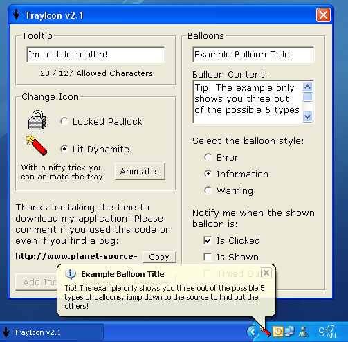

<div align="center">

## TaskTray v2\.0


</div>

### Description

Easily manage an icon in the task tray using a simple class packed full of features that you could ever want in the task tray. You can add, remove, animate, modify, display balloon tips and even tooltips.

This version comes with bug fixes, more error handling and a new demo interface that you will all like! I would like to say a big thanks to Tom Pydeski for pointing out a key bug in the class.

With this demo interface you can add and remove your icon, change the tooltip and even display balloon tips from the icon being displayed. You can also set it up to tell you when events have occured and, best of all, you can even see an example tray icon animation!

This application also shows the best bits of OO programming.
 
### More Info
 
This class only requires a form handle to initialize but it can take inputs of an icon and tooltip to setup the icon properly.

This program asumes you are using an operating systen that supports balloon tips and I am aware this will not work on windows 95 or earlier.

There may be one side effect that has not been tested properly. Since the class uses some MultiCasting it may be possible that certain X values passed to the MouseMove function may be left over messages to the TrayIcon class.


<span>             |<span>
---                |---
**Submitted On**   |2006-03-20 05:00:02
**By**             |[Christopher \(Heenix\) Lord](https://github.com/Planet-Source-Code/PSCIndex/blob/master/ByAuthor/christopher-heenix-lord.md)
**Level**          |Intermediate
**User Rating**    |4.3 (30 globes from 7 users)
**Compatibility**  |VB 6\.0
**Category**       |[Miscellaneous](https://github.com/Planet-Source-Code/PSCIndex/blob/master/ByCategory/miscellaneous__1-1.md)
**World**          |[Visual Basic](https://github.com/Planet-Source-Code/PSCIndex/blob/master/ByWorld/visual-basic.md)
**Archive File**   |[TaskTray\_v1981463202006\.zip](https://github.com/Planet-Source-Code/christopher-heenix-lord-tasktray-v2-0__1-64701/archive/master.zip)

### API Declarations

```
Private Declare Function Shell_NotifyIconW Lib "shell32.dll" (ByVal dwMessage As Long, lpData As NOTIFYICONDATAW) As Long
```


